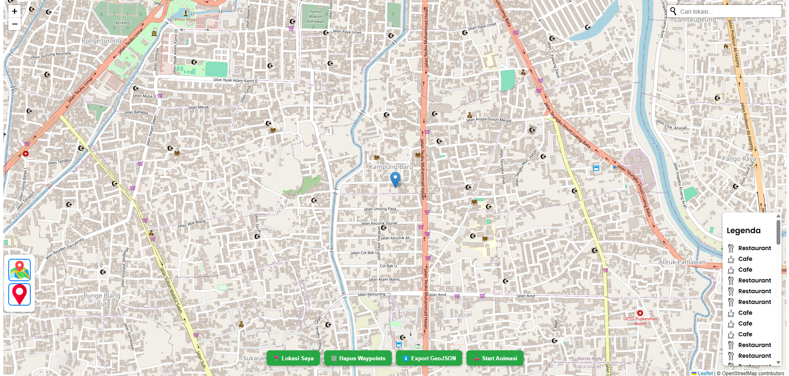
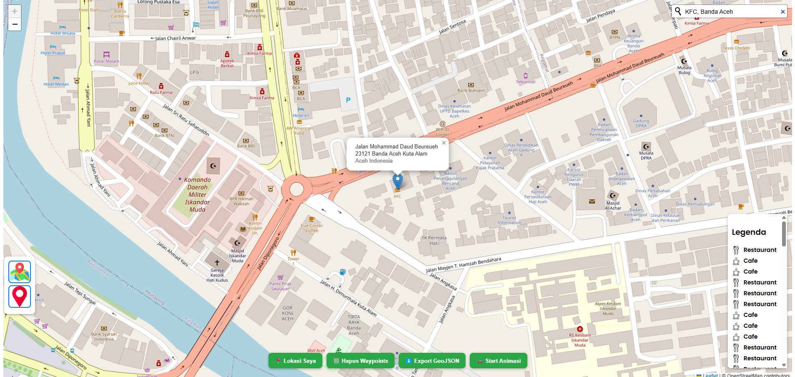

# WebGIS

### Nama  : Muhammad Hizqil Alfi
### NPM   : 2308107010046

## 📄Deskripsi

WebGIS ini memungkinkan pengguna untuk mengeksplorasi peta global, menentukan rute perjalanan, dan melihat fasilitas umum seperti kafe, restoran, dan sekolah. Dibangun dengan teknologi web modern seperti HTML, CSS, JavaScript, dan Leaflet.js, aplikasi ini mendukung fitur geolokasi, ekspor data rute dalam format GeoJSON, serta pemilihan peta dasar (OSM atau citra satelit). Dirancang untuk memberikan pengalaman pengguna yang responsif dan mudah diakses di berbagai perangkat.

## 🎯Tujuan
- Akses Mudah Data Geospasial
- Interaktivitas Pengguna
- Kolaborasi dan Pembagian Data
- Pemantauan dan Analisis Berbasis Lokasi
- Mendukung Pengambilan Keputusan
- Meningkatkan Efisiensi Operasional

## 📌Link 
https://alfihzql.github.io/WebGIS/

## 🖼️Gambar

 

## 🫡Terimakasih
